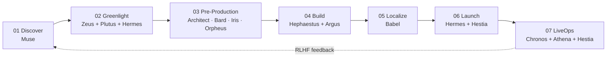

# Pantheon — Architecture

> *"It is not a chatbot. It is a studio."*

This document describes the runtime architecture of Pantheon: how fourteen long-running Claude agents coordinate, share memory, debate, and produce shipped games end-to-end.

---

## 1. Topology

```
                              ┌──────────────────────┐
                              │       ZEUS           │
                              │   Orchestrator       │
                              │  (state machine,     │
                              │   debate referee,    │
                              │   final go/no-go)    │
                              └──────────┬───────────┘
                                         │
                ┌────────────────────────┴───────────────────────┐
                │                                                │
        ┌───────▼────────┐                              ┌────────▼───────┐
        │ PRODUCTION WING │                              │ BUSINESS WING  │
        │                 │                              │                │
        │  Muse           │                              │  Plutus  (CFO) │
        │  Architect      │                              │  Hermes  (CMO) │
        │  Bard           │                              │  Hestia  (CM)  │
        │  Iris           │                              │  Chronos (Ops) │
        │  Orpheus        │                              │  Athena  (Data)│
        │  Hephaestus     │                              │                │
        │  Argus          │                              │                │
        │  Babel          │                              │                │
        └────────┬────────┘                              └────────┬───────┘
                 │                                                │
                 └───────────────────┬────────────────────────────┘
                                     │
                  ┌──────────────────▼──────────────────┐
                  │      SHARED MEMORY (Postgres +       │
                  │      pgvector + audit log)           │
                  └──────────────────┬──────────────────┘
                                     │
                  ┌──────────────────▼──────────────────┐
                  │   EXTERNAL BRIDGES                   │
                  │   • SDXL/Flux (Iris)                 │
                  │   • Suno + ElevenLabs (Orpheus)      │
                  │   • Unity/Godot CLI (Hephaestus)     │
                  │   • Steamworks API                   │
                  │   • Discord / Reddit / TikTok        │
                  └─────────────────────────────────────┘
```

## 2. Core principles

### 2.1 Multi-agent, not multi-prompt
Each of the fourteen agents holds **its own long-running context**. They do not share a single prompt. Cross-agent communication happens through structured messages persisted to the audit log, not through prompt concatenation.

### 2.2 Long-chain reasoning by default
A single greenlight decision involves Muse → Plutus → Hermes → Zeus, each running a multi-step reasoning chain over hundreds of thousands of tokens of historical context (Steam top-100, prior cohort retention, ad-funnel performance). This is the workload pattern Max-tier plans exist for.

### 2.3 Auditability over speed
Every cross-agent message is written to an append-only log. Every decision can be replayed. This is non-negotiable: it is the foundation for both trust and the RLHF self-improvement loop.

### 2.4 Bridges, not built-ins
Pantheon does not generate pixels or audio itself. It orchestrates **bridges** to specialized models (SDXL, Flux, Suno, ElevenLabs) and reasons over the curated outputs. Claude is the conductor; the bridges are the orchestra.

## 3. The seven-stage loop



Each transition is a structured handoff: the upstream agent emits a contract document (concept brief, GDD, build artifact, localized package, launch report) which becomes the downstream agent's input context.

## 4. Memory architecture

| Layer | Storage | Purpose |
| --- | --- | --- |
| **Working memory** | per-agent context window | active reasoning |
| **Episodic memory** | Postgres tables | per-game artifacts (GDDs, builds, launch reports) |
| **Semantic memory** | pgvector embeddings | cross-game pattern retrieval ("what worked for hyper-casual launches?") |
| **Audit log** | append-only Postgres | every cross-agent message, immutable |
| **External state** | Steamworks, Discord API, telemetry | source of truth for the world |

## 5. The Zeus state machine

Zeus does not generate creative output. Its job is to **arbitrate** and **gate**.

```
States:  IDLE → DISCOVERING → DEBATING → BUILDING → LIVE → POSTMORTEM → IDLE

Transitions are gated by:
- Quorum (e.g., greenlight needs Plutus AND Hermes signoff)
- Threshold (e.g., Argus must report < 5 P0 bugs to enter LAUNCH)
- Budget (e.g., Hephaestus token spend below ceiling)
- Calendar (e.g., LiveOps event windows)
```

Every state transition is logged with the inputs that justified it. A failed transition triggers a retry with critique, not a hard stop.

## 6. Token-budget model

Token spend is **not uniform**. Hephaestus and Babel dominate during build phases; Hestia and Chronos dominate during LiveOps. Zeus negotiates a monthly budget across agents based on the studio phase.

| Phase | Top spenders |
| --- | --- |
| Build | Hephaestus, Babel, Bard |
| Launch | Hermes, Babel |
| LiveOps | Chronos, Hestia, Athena |
| Discovery | Muse, Athena |

See [README.md](./README.md#token-economics) for the steady-state breakdown.

## 7. Failure modes & mitigations

| Failure | Mitigation |
| --- | --- |
| Agent loops on a stuck reasoning chain | Zeus timeout → escalate to peer-review by sibling agent |
| Cross-agent disagreement (Plutus vs Hermes on greenlight) | Structured debate protocol, Zeus arbitration |
| Bridge service outage (e.g., SDXL down) | Iris falls back to cached style packs, queues for retry |
| Token budget exhausted mid-build | Chronos defers non-critical LiveOps; Zeus pauses Discovery |
| Hallucinated codepath in Hephaestus output | Argus regression suite catches before merge to main |

## 8. Why this needs the Max plan

Every agent above is independently long-context. Hephaestus alone reasons over a 30K+ LOC codebase. Babel translates entire dialogue trees. Athena correlates millions of telemetry events. **The Pro plan throttles the studio to one agent at a time.** The Max plan unlocks parallel operation — which is the entire point.

---

*See [ROADMAP.md](./ROADMAP.md) for the 90-day build sequence and [`docs/agents/`](./docs/agents) for individual agent charters.*
